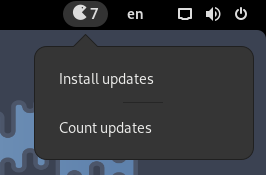

# Pacman-Update-for-GNOME-Shell
Count and install pacman, AUR and flatpak updates with a GNOME Shell extension. Written in Javascript.
  

  
<i>This extension runs asynchronously, so it doesn't slow up GNOME Shell Main loop.</i>
