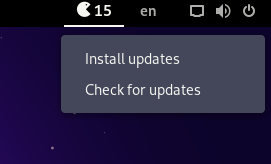

# Pacman-Update-for-GNOME-Shell
Count and install pacman, AUR and flatpak updates with a GNOME Shell extension written in Javascript.
  

  
<i>This Js extension runs asynchronously, so it doesn't slow up GNOME Shell's Main loop.</i>
